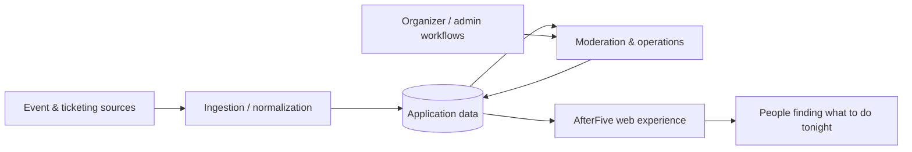

# AfterFive

### Find the move after five.

AfterFive is a culture-led nightlife discovery product designed to reduce the work it takes to figure out where to go out.

It brings relevant events into a focused multi-city experience built around R&B, hip-hop, Afrobeats, amapiano, dancehall, reggae, and adjacent nightlife culture.

**Live product:** https://afterfive.tech

> **Repository note:** This is a public product and engineering case study. The production application source is intentionally private. This repository contains no production credentials, private environment configuration, proprietary source code, or sensitive operational data.

## What I built

AfterFive combines consumer discovery with the operational tooling needed to keep event data useful and manageable.

### Consumer experience
- Multi-city nightlife discovery
- Event-focused browsing designed around going-out intent
- Mobile-first / PWA experience
- Featured and curated event surfaces
- Event imagery and structured event details

### Operations and data
- External event-data ingestion
- Moderation and approval workflows
- Event editing and lifecycle management
- Data-health and readiness checks
- Recurring event-series support
- Organizer/admin workflows

### Product tooling
- Internal site and content controls
- Structured editing workflows
- Change-plan / review patterns before applying edits
- Undo / redo patterns
- Brand and presentation controls

## Technology

| Area | Technology |
|---|---|
| Application | Next.js, React, TypeScript |
| Data | Supabase, PostgreSQL |
| Hosting | Vercel |
| Product format | Responsive web app / PWA |
| Integrations | External event and ticketing APIs |
| Delivery | Git + GitHub, automated QA and staged deployments |

## High-level architecture

The public diagram is intentionally high level. Internal schemas, credentials, privileged routes, provider configuration, and implementation-specific production logic are not published here.

## Engineering focus

The project has required more than building UI. The work includes:

- translating a product concept into a maintainable data model
- integrating third-party event sources
- separating ingestion, moderation, and consumer presentation
- building operational controls for non-code workflows
- designing recurring-event behavior and ownership rules
- handling QA and regression safety as the feature surface expands
- maintaining production isolation while new functionality is staged

## Why this repository exists

AfterFive is an active product rather than an open-source code sample.

This public repository is intended to show the **scope of the product, architecture, systems thinking, implementation work, and technical decisions** without publishing the private production codebase.

## More

- [Product overview](docs/product.md)
- [Architecture and engineering approach](docs/architecture.md)
- [Security and disclosure boundaries](SECURITY.md)
- [Screenshots](screenshots/README.md)

---

**Built by Michael Munyaneza**
